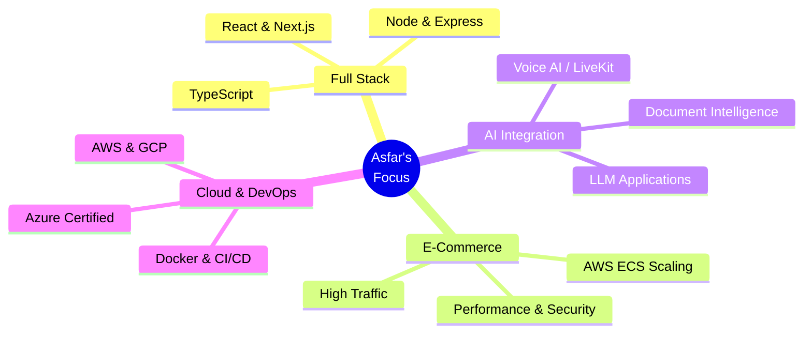

<!-- ====================== HEADER BANNER ====================== -->
<div align="center">


<!-- ====================== TYPING SVG ====================== -->
<a href="https://asfar-waheed.vercel.app/">
  
</a>

<br/>

⚡ **Engineering products that scale — one system at a time**
<br/>
🧠 Web Platforms · E-Commerce · AI Integration · Cloud & DevOps

<br/>

<!-- ====================== STAT BADGES ====================== -->


<br/><br/>

<!-- ====================== SOCIAL LINKS ====================== -->
<a href="https://asfar-waheed.vercel.app/"></a>
<a href="https://github.com/asfarwaheed01"></a>
<a href="https://linkedin.com/in/asfar-waheed"></a>
<a href="mailto:asfarwaheed01@gmail.com"></a>
<a href="https://www.leetcode.com/asfarwaheed01"></a>

</div>

<br/>

<!-- ====================== ABOUT ME ====================== -->
## 🟪 About Me <sub>`// who am i`</sub>

```ts
const asfar = {
  role: "Software Engineer",
  base: "Lahore, Pakistan 🇵🇰",
  focus: ["High-traffic e-commerce", "AI-integrated products", "Cloud & DevOps"],
  stack: {
    frontend: ["React", "Next.js", "TypeScript", "Redux", "Tailwind"],
    backend:  ["Node.js", "Express", "Nest.js", "Django"],
    cloud:    ["AWS (ECS, S3, App Runner)", "GCP", "Vercel"],
    data:     ["MongoDB", "PostgreSQL", "MySQL", "Firebase"],
  },
  certified: ["Azure Developer Associate", "DevOps Engineer Expert"],
  Currently exploring: ["LLM apps", "Voice AI", "RAG pipelines"],
};
```

- 🏗️ I build and scale **high-traffic e-commerce platforms** that serve thousands of concurrent users.
- 🤖 I integrate **GenAI** into real products — voice interviews, AI document processing, and intelligent workflows.
- ☁️ Microsoft-certified in **Azure** and **DevOps** — comfortable from frontend to containerized cloud deployment.
- 🎓 **BS Computer Science**, University of Engineering & Technology (UET) Lahore.

<br/>

<!-- ====================== CURRENT FOCUS (MERMAID) ====================== -->
## 🟦 Current Focus <sub>`// what i'm working on`</sub>



<br/>

<!-- ====================== TECH ARSENAL ====================== -->
## 🟥 Tech Arsenal <sub>`// tools of the trade`</sub>

**🎨 Frontend / UI**


**⚙️ Backend / APIs**


**🗄️ Databases**


**☁️ Cloud / DevOps / Tools**


<br/>

<!-- ====================== FEATURED PROJECTS ====================== -->
## 🟩 Featured Projects <sub>`// what i've built`</sub>

<table>
<tr>
<td width="50%" valign="top">

### 🛒 ALFA MALL
High-traffic **e-commerce marketplace** serving thousands of active users. Optimized infra with smart caching (−10% AWS cost), patched SSRF vulnerabilities, and shipped containerized deployments on **AWS ECS**.

`Next.js` `React` `AWS ECS` `Redux Toolkit` `SCSS` `MUI`

🔗 **[Live →](https://alfamall.com/)**

</td>
<td width="50%" valign="top">

### 🎤 INTERVIA AI
End-to-end **AI interview platform**. Built backend + frontend, integrated **LiveKit** for real-time voice interviews with instant AI feedback (−35% evaluation time), and shipped AI-driven career recommendations. 99.9% uptime on AWS.

`Next.js` `TypeScript` `Node.js` `LiveKit` `OpenAI` `MongoDB`

🔗 **[Live →](https://intervia.ai/)**

</td>
</tr>
<tr>
<td width="50%" valign="top">

### 📄 SQUIRKLE AI
**AI document-processing** system with a chat interface, chat history, and pay-as-you-go billing. Integrated **Stripe** and built a highly optimized, SEO-friendly, non-blocking UI.

`React` `Tailwind` `GCP App Engine` `Stripe` `Context API`

🔗 **[Live →](https://squirkle.xyz/)**

</td>
<td width="50%" valign="top">

### 📱 MoAI — Move More Together
**AI-powered wellness companion** using Apple Health & Google Health Connect. Available on both app stores.

`React Native` `AI` `Apple Health` `Health Connect`

🔗 **[App Store →](https://apps.apple.com/us/app/moai-move-more-together/id6749557946)** · **[Play Store →](https://play.google.com/store/apps/details?id=com.jaydholakia.movewithmoai)**

</td>
</tr>
<tr>
<td width="50%" valign="top">

### 🏢 CONPHERE
Business / **SaaS platform** built and shipped to production.

`Next.js` `Node.js` `Cloud`

🔗 **[Live →](https://conphere.com/)**

</td>
<td width="50%" valign="top">

### 🛍️ BAREEZE & SANAULLA STORE
Single-brand **e-commerce sites** with SSR/SSG product pages, Redux-managed carts & sessions, containerized and deployed on **AWS ECS** for high availability.

`Next.js` `Redux` `Ant Design` `Docker` `AWS ECS`

🔗 **[Bareeze →](https://bareeze.com/)** · **[Sanaulla →](https://sanaullastore.com/)**

</td>
</tr>
</table>

<br/>

<!-- ====================== GITHUB STATS ====================== -->
## 📊 GitHub Stats <sub>`// the numbers`</sub>

<div align="center">


<br/>


<br/><br/>

</div>

<br/>

<!-- ====================== CERTIFICATIONS ====================== -->
## 🏅 Certifications <sub>`// verified`</sub>

- 🔷 **Azure Developer Associate** — Microsoft Certified · *Jun 2025*
- 🔶 **DevOps Engineer Expert** — Microsoft Certified · *Mar 2025*
- 🎨 **CSS Flexbox & Responsive Web Design** — Coursera · *Jul 2024*
- 🤖 **Machine Learning** — Coursera · *Jul 2023*

<br/>

<!-- ====================== FOOTER ====================== -->
<div align="center">

### 💬 Let's build something great together

<a href="mailto:asfarwaheed01@gmail.com"></a>


</div>
